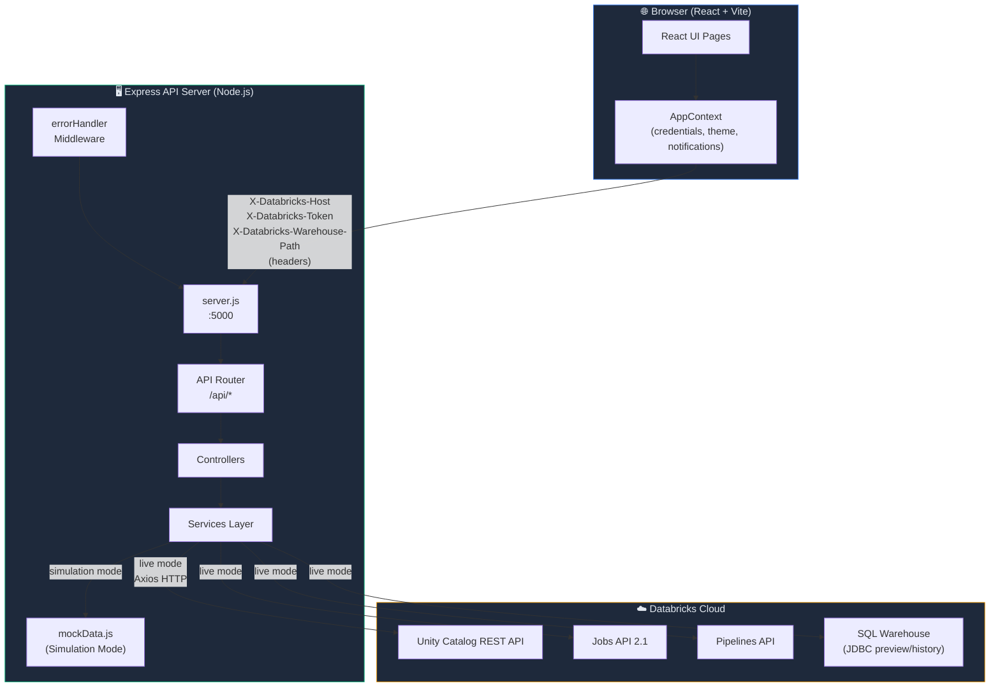
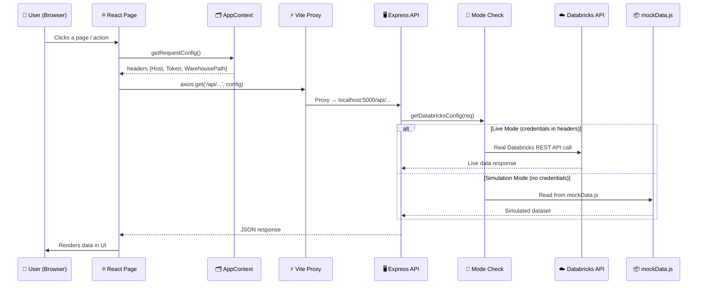

# 🔭 DataAtlas — Enterprise Databricks Metadata Intelligence Platform

> **DataAtlas** is a full-stack observability and metadata intelligence platform for **Databricks Unity Catalog**. It provides real-time catalog browsing, lineage tracing, impact analysis, workflow monitoring, and ownership governance — all in a beautiful, production-ready web UI.

### 🌐 Live Production Deployments
- **Frontend App**: [https://data-atlas-sooty.vercel.app](https://data-atlas-sooty.vercel.app)
- **Backend API**: [https://data-atlas-backend.vercel.app](https://data-atlas-backend.vercel.app)

---

## ✨ Features at a Glance

| Feature | Description |
|---------|-------------|
| 📊 **Executive Dashboard** | Real-time KPIs — catalogs, schemas, tables, jobs, pipelines, storage |
| 🗂️ **Data Catalog Browser** | Three-pane Unity Catalog explorer with table profiles |
| 🔍 **Global Search** | Federated search across tables, jobs, pipelines, and schemas |
| 🧬 **Lineage Explorer** | Interactive graph tracing upstream/downstream dependencies |
| 💥 **Impact Analysis** | Blast radius simulation — "what breaks if this table changes?" |
| ⚙️ **Job Explorer** | Databricks Workflow jobs, schedules, run history, compute targets |
| 🌊 **Pipeline Explorer** | Delta Live Tables (DLT) pipelines, status, and cluster allocation |
| 👥 **Ownership Center** | Per-owner asset inventory across tables, jobs, and pipelines |
| 📈 **Metadata Analytics** | Schema growth rates, table size distribution, criticality rankings |
| 🔒 **Live + Simulation Modes** | Works without credentials (simulation) or with live Databricks workspace |

---

## 🏗️ High-Level Architecture



---

## 🔄 Request Lifecycle Flow



---

## 📁 Monorepo Structure

```
DataScope/
├── 📄 package.json          # Root: concurrently runs both servers
├── 📄 README.md             # This file
│
├── backend/                 # Express.js API server
│   ├── server.js            # Entry point, middleware, port binding
│   ├── .env / myenv         # Environment configuration (gitignored)
│   ├── config/              # getDatabricksConfig() — mode detection
│   ├── controllers/         # Route handlers (thin layer)
│   ├── routes/              # Express router: /api/*
│   ├── services/            # Business logic per domain
│   │   ├── analyticsService.js
│   │   ├── authService.js
│   │   ├── catalogService.js
│   │   ├── impactService.js
│   │   ├── jobService.js
│   │   ├── lineageService.js
│   │   ├── pipelineService.js
│   │   ├── searchService.js
│   │   └── mockData.js      # Simulation dataset (no Databricks needed)
│   └── middlewares/
│       └── error.js         # Global error handler → structured JSON
│
└── frontend/                # React + Vite SPA
    ├── index.html
    ├── vite.config.js       # Proxy /api → localhost:5000
    └── src/
        ├── App.jsx           # Router definitions
        ├── main.jsx          # React entry point
        ├── index.css         # Global design tokens + grid system
        ├── context/
        │   └── AppContext.jsx # Credentials, theme, notifications state
        ├── layouts/
        │   └── AppLayout.jsx  # Sidebar, header, breadcrumbs, modal
        ├── pages/             # One file per route
        ├── components/        # Reusable: DataTable, MetricCard, LineageGraph
        └── styles/            # CSS Modules per layout
```

---

## 🚀 Quick Start

### Prerequisites

- **Node.js** v18 or later
- **npm** v9 or later
- *(Optional)* A Databricks workspace with a Personal Access Token

### 1. Clone & Install

```bash
git clone https://github.com/your-username/DataScope.git
cd DataScope

# Install all dependencies (root + backend + frontend)
npm run setup
```

### 2. Configure Environment

```bash
# Backend configuration
cp backend/.env.example backend/.env
```

Edit `backend/.env`:

```env
PORT=5000

# Leave blank to run in Simulation Mode (no Databricks needed)
DATABRICKS_HOST=https://your-workspace.azuredatabricks.net
DATABRICKS_TOKEN=dapi...
DATABRICKS_SQL_HTTP_PATH=/sql/1.0/warehouses/your-warehouse-id
```

> **Simulation Mode**: If you leave `DATABRICKS_HOST` and `DATABRICKS_TOKEN` empty, the server starts in **Simulation Mode** using realistic mock data — perfect for development and demos.

### 3. Run Development Servers

```bash
npm run dev
```

This concurrently starts:
- **Backend** → `http://localhost:5000`
- **Frontend** → `http://localhost:3000` (with Vite proxy to backend)

Open [http://localhost:3000](http://localhost:3000) in your browser.

---

## 🔐 Live Connection (Optional)

You can also connect to a live Databricks workspace **directly from the UI** without restarting the server:

1. Click **"Connect Live DB"** in the top navbar
2. Enter your Workspace Host, Personal Access Token, and SQL Warehouse HTTP Path
3. Credentials are stored only in **`sessionStorage`** (browser memory) — never on disk or in any database
4. Click **"Disconnect"** or close the tab to clear all credentials instantly

---

## 🧑‍💻 Development Mode Isolation

The backend enforces strict **mode isolation**:

| Mode | Trigger | Data Source | Error Handling |
|------|---------|------------|----------------|
| **Simulation** | No credentials in `.env` or request headers | `mockData.js` | Returns mock data |
| **Live** | Valid `Host` + `Token` in headers | Databricks REST APIs | Throws structured error → HTTP 500 |

There is **zero fallback** between modes — a live mode failure returns an error to the frontend, never silently switches to mock data.

---

## 🤝 Contributing

We welcome contributions! Please follow these steps:

### 1. Fork & Branch

```bash
git checkout -b feature/your-feature-name
# or
git checkout -b fix/bug-description
```

### 2. Backend Contribution Guide

- Each **service** in `backend/services/` handles one domain
- Always add both `simulation` and `live` branches inside each service method:
  ```js
  static async myMethod(config) {
    if (config.simulation) {
      return mockData.something; // simulation path
    }
    try {
      // real Databricks API call
    } catch (error) {
      throw new Error(`Descriptive error: ${error.message}`); // never swallow
    }
  }
  ```
- **Never** hardcode workspace names, table names, or email addresses
- **Never** add a mock fallback in the `live` branch

### 3. Frontend Contribution Guide

- All API calls must go through `axios` using `getRequestConfig()` from `AppContext`
- Wrap every API call in `try/catch` and call `addNotification(message, 'error')` on failure
- Do **not** use `import.meta.env.VITE_*` for Databricks credentials — those come from the backend context
- Use the existing CSS design tokens (`var(--color-blue)`, etc.) — do not add inline hex colors

### 4. Commit & PR

```bash
git add .
git commit -m "feat: add <feature description>"
git push origin feature/your-feature-name
```

Open a Pull Request with a clear description of what changed and why.

---

## 📜 API Endpoints Reference

| Method | Endpoint | Description |
|--------|----------|-------------|
| `POST` | `/api/auth/test` | Validate Databricks credentials |
| `GET` | `/api/analytics/overview` | Dashboard KPIs and chart data |
| `GET` | `/api/catalog/catalogs` | List all Unity Catalogs |
| `GET` | `/api/catalog/schemas?catalog=` | List schemas in a catalog |
| `GET` | `/api/catalog/tables?catalog=&schema=` | List tables in a schema |
| `GET` | `/api/catalog/table/details?catalog=&schema=&table=` | Table profile + columns |
| `GET` | `/api/catalog/table/history?catalog=&schema=&table=` | Delta Lake history |
| `GET` | `/api/catalog/table/preview?catalog=&schema=&table=` | Sample rows (warehouse) |
| `GET` | `/api/catalog/all-tables-metadata` | All tables flat list (ownership) |
| `GET` | `/api/jobs` | List all Workflow jobs |
| `GET` | `/api/jobs/:jobId` | Job details + run history |
| `GET` | `/api/pipelines` | List all DLT pipelines |
| `GET` | `/api/pipelines/:pipelineId` | Pipeline details |
| `GET` | `/api/lineage?table=` | Lineage graph for a table |
| `GET` | `/api/impact/critical` | Critical dataset rankings |
| `GET` | `/api/impact/analysis?table=` | Impact analysis for a table |
| `GET` | `/api/search?q=` | Federated search across all assets |

---

## 🛠️ Tech Stack

### Backend
- **Runtime**: Node.js 18+
- **Framework**: Express.js 4
- **HTTP Client**: Axios (Databricks API calls)
- **Dev Server**: Nodemon
- **Config**: dotenv

### Frontend
- **Framework**: React 18
- **Build Tool**: Vite
- **Routing**: React Router v6
- **HTTP Client**: Axios (with Vite proxy)
- **Charts**: Recharts
- **Graph**: React Flow
- **Icons**: Lucide React
- **Styling**: Vanilla CSS + CSS Modules

---

## 📄 License

MIT © DataAtlas Contributors